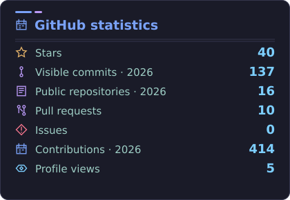
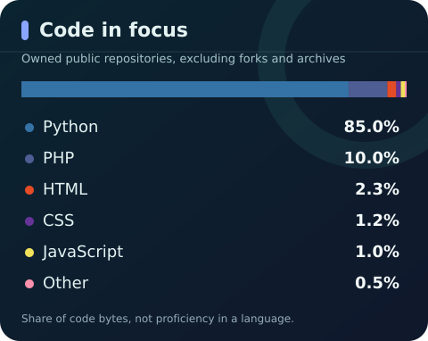
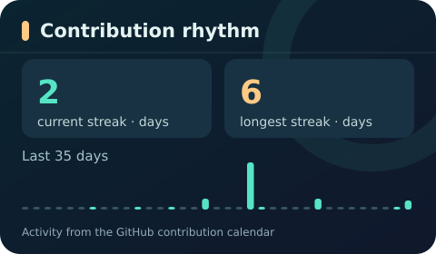

# GitHub Profile Card

[Português](README.md) · [MIT License](LICENSE) · [Open the web generator](https://guicodelabs-profile-card.vercel.app)

Three original SVG cards for **GitHub contributions, languages and streaks**. The visual uses familiar icons and aligned values for quick scanning, taking inspiration from cards such as [GitHub Readme Stats](https://github.com/anuraghazra/github-readme-stats); this project's SVGs, icons and code are original. This project powers [Guilherme Beserra's profile](https://github.com/GuiCodeLabs) and can be copied for your own profile.

<p align="center">
  
  
</p>
<p align="center">
  <picture>
    <source media="(max-width: 600px)" srcset="profile/rhythm-mobile-en.svg" />
    
  </picture>
</p>

The status card shows current-year commits, repositories with commits, contribution-calendar totals, stars, PRs, issues and profile views. A private contribution total requires an optional classic token with only the `read:user` scope. The lower card keeps the all-time contribution total and streaks. Private repository names and source code are never written to the SVGs.

The language card analyzes owned public repositories by default. To include accessible private repositories, add a fine-grained, read-only token with Metadata: read access on selected repositories as the `PRIVATE_REPOSITORIES_TOKEN` Actions secret. Only aggregate language names and byte counts are written to the generated cards; repository names and source code are not.

## Add them to your profile

1. Create a public copy of this repository. Edit `profile-card.json` with your username, display name and repositories to omit **from the language card only**.
2. Enable Actions and allow it to write to your main branch. Public data works by default. Add `PRIVATE_CONTRIBUTIONS_TOKEN` with only `read:user` for private contribution totals and `PRIVATE_REPOSITORIES_TOKEN` with Metadata: read on selected repositories for private languages; see [the permission guide](docs/CUSTOMIZATION.md).
3. Paste the snippet from the [web generator](https://guicodelabs-profile-card.vercel.app), or embed the images from your copy of the repository:

```html
<p align="center">
  
  
</p>
<p align="center">
  <picture>
    <source media="(max-width: 600px)" srcset="https://raw.githubusercontent.com/YOUR_USER/github-profile-card/main/profile/rhythm-mobile-en.svg" />
    
  </picture>
</p>
```

Use filenames without a suffix for Portuguese or with `-es` for Spanish. The language of a README image cannot be automatically selected for each viewer. **Programming languages** are detected from owned public repositories by default and from selected private repositories when the optional token is configured.

## How it works

GitHub Actions tests pushes and pull requests. A scheduled job regenerates cards every **15 minutes**, subject to delays, and commits only changed metrics as `github-actions[bot]`; those commits represent generated data. Human code changes remain attributed to their authors. The optional [live SVG endpoint](docs/CUSTOMIZATION.md#visitas-dentro-do-cartão) queries a view count when the Vercel function receives an origin request. GitHub's Camo proxy may reuse a cached image, so **one increment per page reload is not guaranteed**. CI cannot detect a reader's image reload.

See [metric definitions](docs/METRICS.md), [customization and troubleshooting](docs/CUSTOMIZATION.md), and [contribution guide](CONTRIBUTING.md). Runs on Python 3.11+ and Node.js 20+; the generator has no package dependencies.

```bash
python3 -m unittest discover -s tests -v
npm test
```
