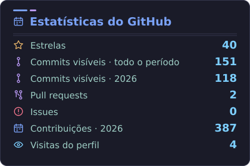
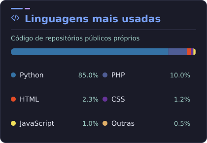
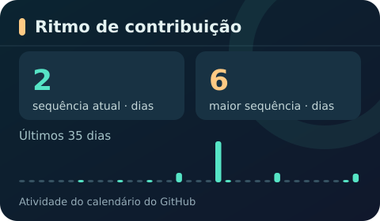

# GitHub Profile Card

[English](README.en.md) · [Licença MIT](LICENSE)

Três cartões SVG para apresentar **contribuições, linguagens e sequências** de um perfil GitHub. O visual usa linhas com ícones familiares e números alinhados, inspirado na leitura rápida de cartões como [GitHub Readme Stats](https://github.com/anuraghazra/github-readme-stats); os SVGs, ícones e o código deste projeto são próprios. O gerador não tem dependências externas. Este repositório alimenta o [perfil de Guilherme Beserra](https://github.com/GuiCodeLabs).

<p align="center">
  
  
</p>
<p align="center">
  <picture>
    <source media="(max-width: 600px)" srcset="profile/rhythm-mobile.svg" />
    
  </picture>
</p>

## O que ele mostra

- **Contribuições totais e no ano:** dados do calendário do GitHub, incluindo contagens privadas anônimas quando o usuário habilita essa opção. Os repositórios privados continuam privados.
- **Atividade privada anônima e commits visíveis:** números separados, sem chamar todas as contribuições privadas de commits.
- **Estrelas, PRs, issues e visitas:** as visitas aparecem dentro do primeiro cartão; o endpoint opcional busca uma contagem nova quando recebe a imagem.
- **Linguagens e sequências:** linguagens detectadas automaticamente nos repositórios públicos próprios; sequência calculada com os dias do calendário.
- **Visual responsivo e três idiomas:** dois cartões no computador, empilhados em telas estreitas, com cartão inferior próprio para celular. PT-BR, inglês e espanhol por nome de arquivo ou parâmetro.

[Como cada métrica é calculada](docs/METRICS.md) · [Personalização, exemplos e solução de problemas](docs/CUSTOMIZATION.md)

## Usar no seu perfil

1. Faça sua cópia pública deste repositório e configure usuário, nome e exclusões de linguagens em [`profile-card.json`](profile-card.json).
2. Ative Actions e permita que o workflow escreva na branch principal. O `GITHUB_TOKEN` automático da execução basta para os dados públicos e as contagens privadas anônimas que você optou por mostrar; **não é necessário um PAT**.
3. Cole o trecho abaixo no README do seu perfil. Troque `SEU_USUARIO` pelo login da sua cópia:

```html
<p align="center">
  
  
</p>
<p align="center">
  <picture>
    <source media="(max-width: 600px)" srcset="https://raw.githubusercontent.com/SEU_USUARIO/github-profile-card/main/profile/rhythm-mobile.svg" />
    
  </picture>
</p>
```

O primeiro cartão pode usar o [endpoint dinâmico](docs/CUSTOMIZATION.md#visitas-dentro-do-cartão) para buscar a contagem de visitas quando o GitHub solicitar uma imagem.

## Atualizações e privacidade

O workflow testa o código em pushes e pull requests; a atualização de métricas gera SVGs a cada **15 minutos**, sujeita a atrasos do agendador do GitHub, e só grava um commit quando algum dado muda. Uma execução diária atualiza o valor de visitas da cópia estática. O README deste repositório usa a cópia estática, para não somar suas visitas ao contador do perfil de Guilherme.

O endpoint dinâmico envia `Cache-Control: no-cache` para pedir que o proxy de imagens do GitHub (Camo) revalide a imagem, além de `no-store` para evitar cache no Vercel. Cada requisição que chega à função consulta o contador; o GitHub ainda controla o próprio proxy, então **não há garantia de uma visita por reload**. Uma Action de CI não recebe os reloads feitos por leitores. A API pública tampouco separa quantos eventos privados anônimos foram especificamente commits ou PRs; mostramos a contagem agregada fielmente.

## Desenvolvimento e colaboração

Python 3.11+ e Node.js 20+. O gerador usa apenas a biblioteca padrão do Python.

```bash
python3 -m unittest discover -s tests -v
npm test
GITHUB_TOKEN=SEU_TOKEN_DE_LEITURA python3 scripts/generate_card.py
```

Não inclua tokens em commits. Para testar a renderização sem rede, veja [as instruções de prévia](docs/CUSTOMIZATION.md#prévia-local). Correções e melhorias são bem-vindas: [como contribuir](CONTRIBUTING.md).
